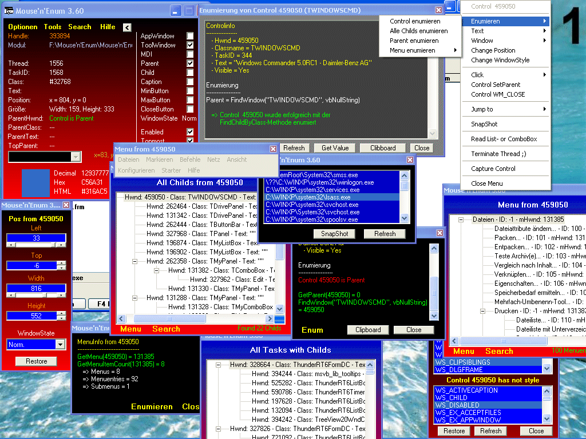



## Mouse'n'Enum

### Description

Mit Mouse’n’ Enum gehören ‚Geheimnisse’ von Fenstern der Vergangenheit an.

Das Hauptfenster zeigt folgende Infos über das Fenster an, über die sich die Mouse gerade befindet: Handle, ModulEXEname, Thread, TaskID, Classname, Text, Position, Größe, ParentHwnd, ParentClass, ParentText, TopParentHwnd, isAppwindow, isToolwindow, isMDI, isParent, isChild, isCaption, IsMinm.Button, isMaxm.Button, isCloseButton, WindowState, isEnabled, isTopmost und selbstverstänlöich die Mousekoordinaten.

Alle Eigenschaften können ausgeblendet werde, sodas nur die Informationen angezeigt werden, die im Moment relevant sind. Wenn gewünscht, kann man sich einen Positionierungsrahmen einblenden, der die Fenster umrandet, über die sich die Mouse befindet.

Befindet sich die Mouse über dem gewünschten Fenster, drückt man F12 und erhält folgende Möglichkeiten:

CONTROL ENUMIEREN Control enumieren: dabei wird versucht das Control durch 3 Methoden zu enumieren (Teilweise mit Codeausgabe, den man in sein eigenes Projekt importieren kann)

Alle Childs enumieren (Die Childs werden in einem Treeview dargestellt, der folgende Infos beinhaltet: Hwnd, Classname, TaskID, Visible, Text), Weiterhin kann man die dargestellten Childs durchsuchen um so ein gewünschtes Child zu finden. Selbstvrständlich kann bei jedem Eintrag mit der Mouse geklickt werden und man erhält wiederrum das vorherige Menu von F12 und kann so die Childs wiederrum bearbeiten.

Parent enumieren. Durch GetParent wird das Parent gesucht und mit Informationen angezeigt. MenukurzInfo: Ein Toolwindow erscheint, das kurze Infos über das Menu des Controls anzeigt.

Menu enumieren: Das Menu des Cntrols wird enumiert und in einem Treeview dargestellt und auf einer Form gespiegelt. Im Treeview selber bekommt an folgende Infos: MenuText, MenuID, MenuHwnd. Folgende Manupulationen können genutzt werden: Edit, Enabled, Checked, Grayed, Click, Delete.

Systemmenuenumierung (funktioniert so wie die Menuenumierung..nur mit dem Systemmenu), Alle Menus von allen Childs….erklärt sich doc von selber. Mit ‚Send Text By String’ und ‚Send Text By Char’ werden eingegebene Texte an ein Control gesendet und Enter gedrückt (ist nützlich wenn ein Control Disabled ist), SetText (Ein eingegebener Text wird an das Control gesendet, SetText from Clipboard & Copy Text to Clipboard (erklärt sich von selber), das WindowUntermeu beinhaltet Hide/Show, Bringtoop, StayOnTop/RemovefromTo, sowie Maximize, Mnimize & Normal.

Mit dem Menueintrag ‚Change Position’ kann ein Control beliebig in seiner Größe verändert erden. Unter ‚Change WindowStyle’ können sämtliche SW_STYLES verändert werden (ein Restore-Button macht geänderte Styles wieder rückgängig. Unter dem ‚Clickuntermenu’ befindet sich ‚Click Control’, Click MousePos, DoubleClick MousePos, RightClick MousePos (Es wird die Koordinate genommen, die die Mouse bei dem Druck auf F12 hatte. Weierhin gibt es ‚Set Parent’ und Send WM_Close. Unter ‚Jump to’ kann man zu dem ‚Parentwindow’ oder zu dem TopParentWindow „jumpen“, das wenn gwünscht sichtbar gemact wird und zur besseren visualisierung geflasht wird. Mit ‚SnapShot’laßen sich gewünschte Control fotorafieren und abspeichern. Unter ‚Read List- or ComboBox’ werden die genannten Boxen ausgelesen und laßen sich manipulieren. Mit ‚Terminate Thread laßen sich Proßesse eliminieren. Mit ‚Capture Control’ wird ein Control auf Veränderung überwacht.

Im ‚SearchMenu’ kann der KOMPLETTE Windows nach Controls durchsucht werden….Entweder mit der Text-Eigenschaft oder es ird nach einem ClassName gesucht.

Alle Proßesse können gelistet werden und als Snapshot gespeichert oder geladen werden (Inaktive Prozeße werden nachgeladen)

Selbstverstänlich laßen sich ALLE Menus im Windows auf einmal enmieren.

Ein Colorpicker zeigt die Farbe des Pixels an. Über dem sich die Maus befindet und gibt den Hex- Dezimal- und HTML-Wert aus.
 
### More Info
 

             |
---                |---
**Submitted On**   |2002-06-08 08:16:50
**By**             |[Wolfgang Ehrhardt](https://github.com/Planet-Source-Code/PSCIndex/blob/master/ByAuthor/wolfgang-ehrhardt.md)
**Level**          |Advanced
**User Rating**    |4.7 (70 globes from 15 users)
**Compatibility**  |VB 6\.0
**Category**       |[Windows API Call/ Explanation](https://github.com/Planet-Source-Code/PSCIndex/blob/master/ByCategory/windows-api-call-explanation__1-39.md)
**World**          |[Visual Basic](https://github.com/Planet-Source-Code/PSCIndex/blob/master/ByWorld/visual-basic.md)
**Archive File**   |[Mouse'n'En91890682002\.zip](https://github.com/Planet-Source-Code/wolfgang-ehrhardt-mouse-n-enum__1-35622/archive/master.zip)

